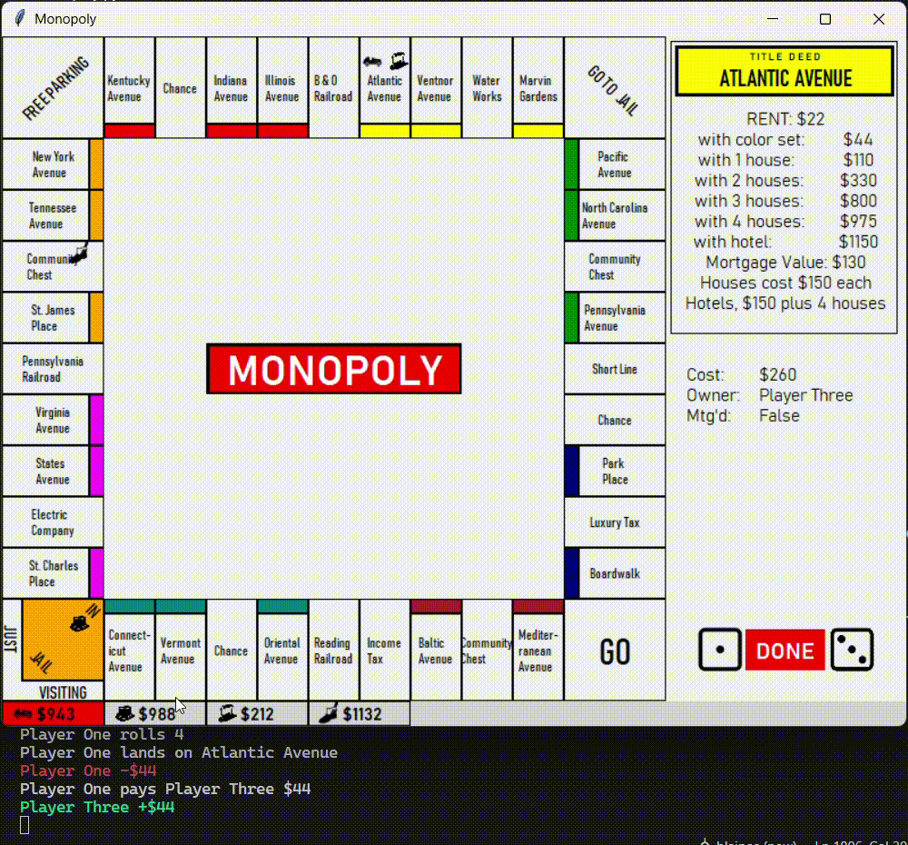

# Monopoly
A 2D-graphic Monopoly PC game made in Python. 

A project by Blaine Jones for learning Tkinter and GUI design.

This Monopoly application enables local, hot-seat play between four players (currently). 

Roll dice, buy properties, draw from Community Chest and Chance, trade with players (see GIF below) and build monopolies!

